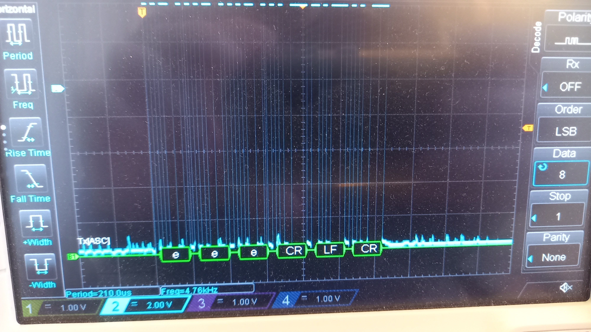

# parportser
a virtual parallel port driver that writes to a serial tty

I've tested this on an Ubuntu 20.04 VM with either a virtual serial port that's connected to the host machine (/dev/ttyS0) or the Nexus USB-serial adapter connected to the VM via redirection.

To build, the attached Makefile should work, but you might need to install the correct linux sources first. I also ran `make oldconfig` and `make modules` on the kernel sources but I'm not sure if that's required.

After building use `load.sh` to load the module. By default it would try to open `/dev/ttyS0`. To use a different tty, provide it as an argument:

```
# ./load.sh /dev/ttyUSB0
```

(Note that load.sh shamelessly claims `/dev/parport0` for itself, so it will probably fail if the computer already has a real parallel port)

`test.zp` is a minimal zep script based on the latency-test repo, it should run fine:


